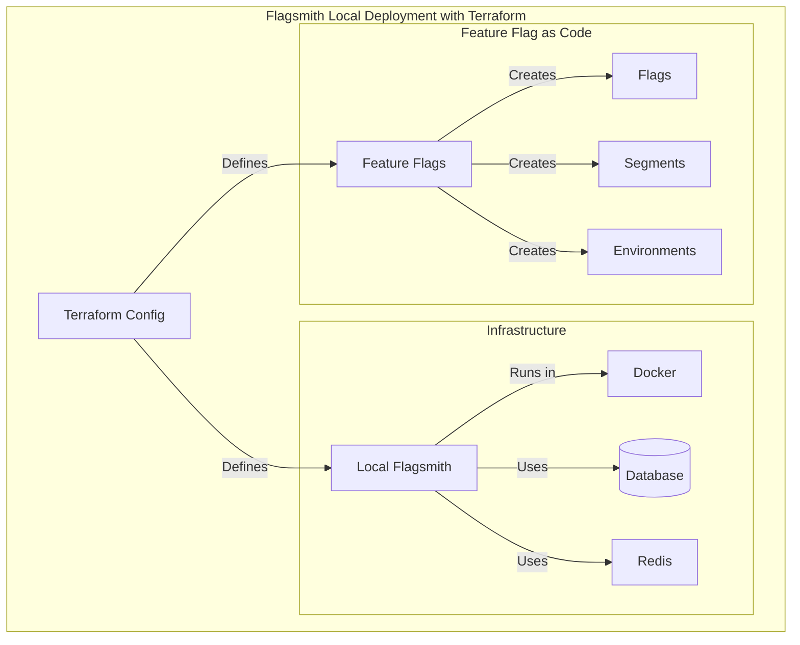

# flagsmith-visual-demo

## Running the Java Apps

```shell
mise install
```

### Linux / Mac

If you run on Linux or Mac, follow these steps:

```sh
# start a single app instance
make j-start
# start multiple instances
make j-all
```

To run a bunch of apps, use [this script](startDemo.sh). This script:
- builds the app (mvn command)
- launches apps
- if you type `q`, it will kill all apps and terminate

### Windows

If you run on Windows, follow these steps:

To run the project: `mvn compile exec:java`

To create a fat jar:

```sh
mvn compile package
java -jar shade\hellofx.jar
```

## Running the Feature Flag System

### Flipt

```shell
brew install flipt-io/brew/flipt
flipt validate features.yml
```

```shell
# Run Flipt locally
# Start Flipt
make flipt-setup

# Stop services
make flipt-stop

# Start services again
make flipt-start

# Restart services
make flipt-restart

# Full cleanup
make flipt-clean
```

- UI: localhost:8080
- Server: localhost:9000, localhost:8080/api/v1

### Flagsmith

```shell
brew tap hashicorp/tap
brew install hashicorp/tap/terraform
```


